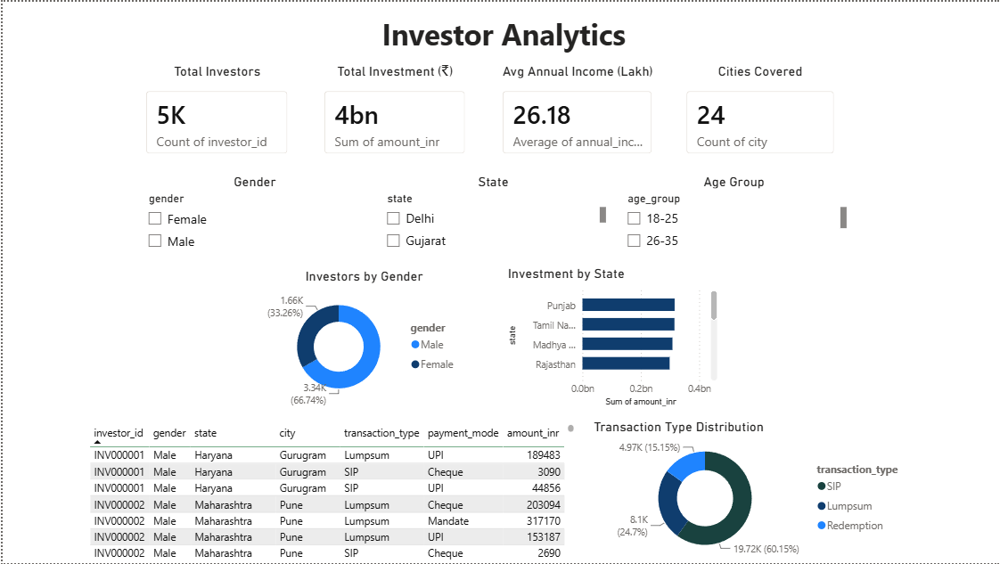

# 📊 Mutual Fund Analytics


A complete **end-to-end Mutual Fund Analytics** project developed as part of the **Bluestock Fintech Internship Capstone**.

This project builds a comprehensive data analytics pipeline covering **ETL, data cleaning, database creation, exploratory data analysis (EDA), mutual fund performance analytics, advanced financial risk analytics, investor behavior analysis, recommendation engine development, and an interactive Power BI dashboard.**

---

# 📌 Project Objectives

- Build an end-to-end ETL pipeline
- Clean and validate mutual fund datasets
- Store processed data in SQLite
- Perform Exploratory Data Analysis (EDA)
- Compute mutual fund performance metrics
- Perform advanced financial risk analytics
- Analyze investor behavior
- Develop a mutual fund recommendation engine
- Create an interactive Power BI dashboard

---

# 🚀 Repository Highlights

- ✅ End-to-End Data Analytics Pipeline
- ✅ SQLite Database Design
- ✅ Exploratory Data Analysis (EDA)
- ✅ Mutual Fund Performance Analytics
- ✅ Advanced Risk Analytics (VaR & CVaR)
- ✅ Investor Cohort Analysis
- ✅ At-Risk Investor Identification
- ✅ Portfolio Diversification Analysis
- ✅ Mutual Fund Recommendation System
- ✅ Interactive Power BI Dashboard

---

# 📈 Project Workflow

```
Raw CSV Files
      │
      ▼
Data Ingestion
      │
      ▼
Data Cleaning
      │
      ▼
SQLite Database
      │
      ▼
Exploratory Data Analysis
      │
      ▼
Performance Analytics
      │
      ▼
Advanced Analytics
      │
      ▼
Recommendation Engine
      │
      ▼
Power BI Dashboard
```

---

# 🖥 Dashboard Preview

> *(Add a screenshot of your Power BI Dashboard here.)*

```text
dashboard/dashboard_preview.png
```

Example:

```markdown

```

---

# ⚙️ Features

## 🔹 ETL Pipeline

- Data Ingestion
- Data Validation
- Missing Value Handling
- Duplicate Removal
- Data Quality Checks
- Clean CSV Generation

---

## 🗄 Database

- SQLite Database
- Normalized Schema
- SQL Queries
- Data Dictionary

---

## 📊 Exploratory Data Analysis (EDA)

Performed comprehensive analysis including:

- NAV Trend Analysis
- SIP Growth Analysis
- AUM Analysis
- Fund House Analysis
- Category Inflow Analysis
- State-wise Investment Analysis
- Investor Demographics
- Portfolio Sector Allocation

Interactive visualizations were generated using **Plotly** and **Matplotlib**.

---

## 📈 Performance Analytics

Calculated key mutual fund performance metrics including:

- Daily Returns
- CAGR
- Sharpe Ratio
- Sortino Ratio
- Alpha
- Beta
- Maximum Drawdown

Generated outputs:

- `fund_performance_metrics.csv`
- `fund_scorecard.csv`

---

## 📉 Advanced Analytics

### Risk Analytics

Implemented:

- Historical Value at Risk (VaR)
- Conditional Value at Risk (CVaR)

Generated:

- `var_cvar_report.csv`

---

### Rolling Sharpe Ratio

Calculated rolling Sharpe Ratio to evaluate risk-adjusted performance over time.

Generated:

- `rolling_sharpe_chart.png`

---

### Investor Cohort Analysis

Grouped investors based on their first investment month to analyze acquisition trends and investor behavior.

---

### At-Risk Investor Identification

Detected inactive investors using transaction gap analysis.

---

### Portfolio Diversification Analysis

Calculated sector concentration using the **Herfindahl-Hirschman Index (HHI)**.

Generated:

- `sector_hhi_report.csv`

---

## 🤖 Mutual Fund Recommendation System

Developed a rule-based recommendation engine considering:

- Risk Appetite
- Sharpe Ratio
- Annual Return
- Annual Volatility

Supported Risk Categories:

- Low Risk
- Moderate Risk
- High Risk

Returns the **Top Recommended Mutual Funds** for investors.

---

## 📊 Power BI Dashboard

Developed an interactive Power BI dashboard containing:

- Executive Summary
- Fund Performance Analysis
- Investor Insights
- Risk Analytics

Dashboard Features:

- Interactive Slicers
- KPI Cards
- Trend Analysis
- Drill-down Reports
- Dynamic Filtering

---

# 📂 Repository Structure

```
Mutual_Fund_Analytics/
│
├── dashboard/
│   ├── Mutual_Fund_Analytics.pbix
│   └── dashboard_preview.png
│
├── data/
│   ├── raw/
│   └── processed/
│
├── docs/
│   ├── BLUESTOCK_FINTECH_Final_Report.pdf
│   ├── Mutual_Fund_Analytics_Presentation.pptx
│   └── ER_Diagram.png
│
├── notebooks/
│   ├── EDA_Analysis.ipynb
│   ├── Performance_Analytics.ipynb
│   └── Advanced_Analytics.ipynb
│
├── reports/
│   └── charts/
│
├── scripts/
│   ├── data_ingestion.py
│   ├── create_database.py
│   ├── live_nav_fetch.py
│   ├── recommender.py
│   └── ...
│
├── sql/
│   ├── schema.sql
│   └── queries.sql
│
├── README.md
├── requirements.txt
└── data_dictionary.md
```

---

# 🛠 Technologies Used

- Python
- Pandas
- NumPy
- Matplotlib
- Plotly
- SciPy
- SQLite
- SQLAlchemy
- Power BI
- Jupyter Notebook
- Git
- GitHub

---

# ▶️ Installation

Clone the repository:

```bash
git clone https://github.com/Sivabandaru26/Mutual_Fund_Analytics.git
```

Navigate to the project directory:

```bash
cd Mutual_Fund_Analytics
```

Install the required packages:

```bash
pip install -r requirements.txt
```

Run the notebooks or Python scripts to reproduce the analysis.

---

# 📦 Project Deliverables

- ETL Pipeline
- Cleaned CSV Files
- SQLite Database Schema
- SQL Queries
- Data Dictionary
- EDA Notebook
- Performance Analytics Notebook
- Advanced Analytics Notebook
- Recommendation Engine
- Power BI Dashboard
- Technical Documentation
- Final Presentation
- Charts & Reports

---

# 📄 Generated Outputs

- Fund Performance Metrics
- Fund Scorecard
- Value at Risk (VaR)
- Conditional Value at Risk (CVaR)
- Rolling Sharpe Ratio
- Sector HHI Report
- Investor Cohort Analysis
- EDA Visualizations
- Performance Reports

---

# 🔮 Future Enhancements

- Streamlit Web Application
- Live NAV API Automation
- Portfolio Optimization
- Monte Carlo Simulation
- Automated Weekly Email Reports

---

# 👨‍💻 Author

**Ratna Siva Kumar Bandaru**

**Bluestock Fintech Internship Capstone Project**

---

# 📜 License

This project was developed as part of the **Bluestock Fintech Internship Capstone** for educational and learning purposes.